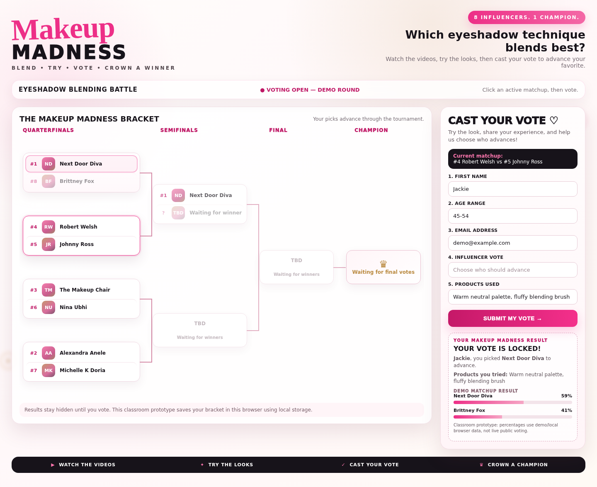

# Makeup Madness 💄🏆

**An 8-influencer, March-Madness-style bracket where viewers vote on who blends eyeshadow best.**

**▶ Live app:** https://jackiehodgephillips-svg.github.io/makeup-madness/

## What it does

Viewers watch each influencer's eyeshadow tutorial, try the look, and vote for who should advance. Each vote locks in a result, moves the winner forward in the bracket, and keeps going until one champion is crowned.

- **8-seed bracket:** #1 vs #8, #4 vs #5, #3 vs #6, #2 vs #7 → Semifinals → Final → Champion
- **5 inputs:** first name, age range, email, influencer vote, products used
- **One button (SUBMIT MY VOTE)** that creates a personalized result, with matchup percentages
- **Live advancement:** winners move straight into the next-round slot
- **Saves in your browser:** your bracket is still there when you come back (uses localStorage, and still works if the browser blocks storage)
- **Responsive:** the vote panel moves under the bracket on smaller screens

### Competitors

| Seed | Influencer |
|---|---|
| 1 | Next Door Diva |
| 2 | Alexandra Anele |
| 3 | The Makeup Chair |
| 4 | Robert Welsh |
| 5 | Johnny Ross |
| 6 | Nina Ubhi |
| 7 | Michelle K Doria |
| 8 | Brittney Fox |

## Tech

One self-contained file, `index.html`, with plain HTML, CSS, and JavaScript. No frameworks, no build step, no server.

To run it, open `index.html` in any browser.

## Background

Final project for **DeepLearning.AI — Build with Andrew** (Andrew Ng). Scored **10/10**.

Built with AI-assisted development: I designed the concept and the design direction, and generated and debugged the code through prompts. One fix was needed for the course's grading portal, which embeds apps inside an iframe and decodes HTML entities. That was breaking the JavaScript, so the code now has no entity literals and survives being embedded.

> Classroom prototype: vote percentages use demo data stored in the browser, not live public voting.

---

Built by **Jackie Hodge-Phillips**
